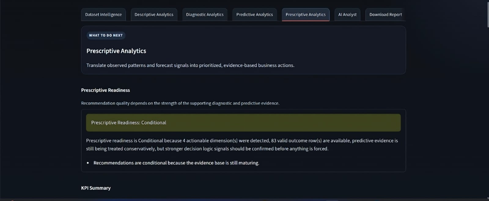
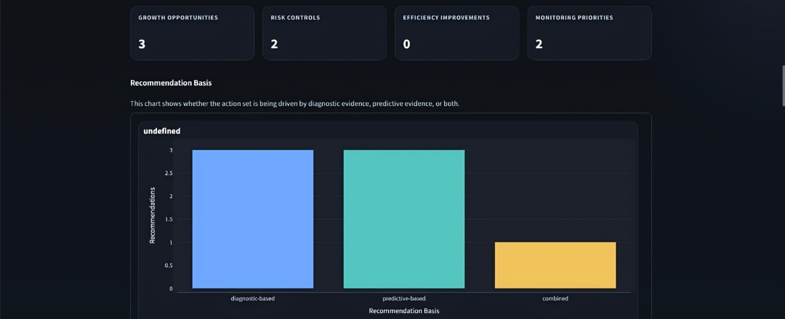
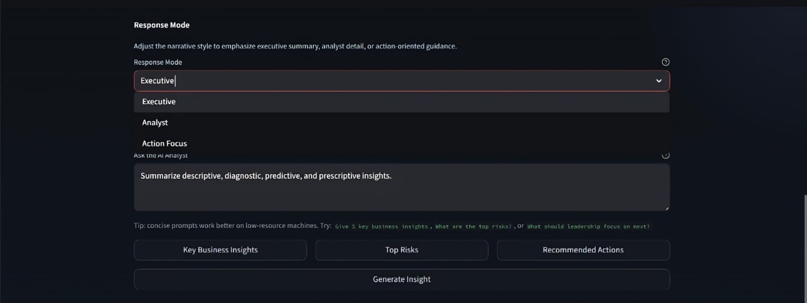
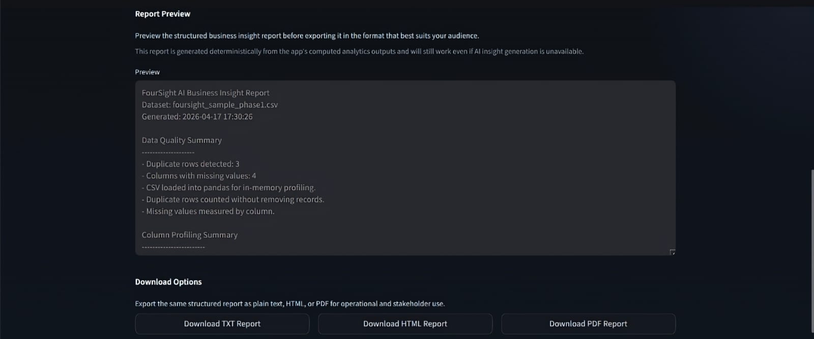

FourSight AI is a modern analytics workspace* that converts raw CSV datasets into structured insights across multiple layers including quality checks, diagnostics, forecasting, and AI-assisted narrative reporting.

---

 🖥️ Application Preview

<p align="center">
  
</p>

---

 📌 What This Project Does

- Upload raw CSV files and automatically process them
- Perform *data quality checks* (missing values, duplicates, schema issues)
- Generate *column profiling insights*
- Build *descriptive analytics summaries*
- Perform *diagnostic analysis* to identify drivers and patterns
- Generate *predictive signals* (where applicable)
- Provide *prescriptive recommendations*
- Add *AI-powered narrative insights (AI Analyst)*
- Export reports in *TXT, HTML, and PDF formats*

---

 📂 Workflow Overview

 🔹 1. Upload Dataset


- Drag-and-drop CSV upload
- Instant ingestion into analytics pipeline
- Opens full analytics workflow

---

 📊 2. Analytics Engine



 Includes:
- Data Quality Layer  
- Column Profiling  
- Dataset Intelligence  
- Descriptive Analytics  
- Diagnostic Analytics  
- Predictive Analytics  
- Prescriptive Analytics  

---

 📈 3. KPI & Visualization Layer

- KPI cards (growth, risk, efficiency, priorities)
- Visual comparison charts
- Clean dark-mode dashboard styling
- Business-ready metric summaries

---

 🤖 4. AI Analyst Layer



  - Local AI model integration (Ollama)
  - Multiple response modes:
  - Executive
  - Analyst
  - Action-focused
  - Prompt-based insight generation
  - Quick action buttons:
  - Key Insights
  - Risks
  - Recommendations

---

 📄 5. Report Export System



- Full report preview
- Structured business insight report
- Export formats:
  - TXT
  - HTML
  - PDF
- Designed for stakeholder sharing

---

 🧠 Key Features

- End-to-end analytics pipeline
- Multi-layer insight generation
- AI-assisted narrative engine
- Clean SaaS-style UI (Streamlit-based)
- Deterministic + AI hybrid system
- Works even without AI (fallback logic)

---

 ⚙️ Tech Stack

- Python
- Streamlit
- Pandas / NumPy
- Matplotlib / Plotly
- Ollama (Local LLM)
- HTML/PDF report generation

---

 🚀 How to Run Locally

```bash
git clone https://github.com/krithic616/FourSight-AI.git
cd FourSight-AI
pip install -r requirements.txt
streamlit run app/main.py
